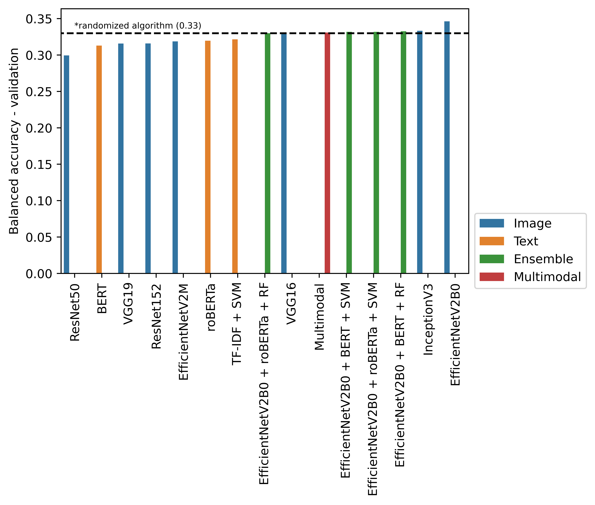

# Meme Sentiment Analysis
- Information on social media comprises of various modalities such as textual, visual and audio. NLP and Computer Vision communities often leverage only one prominent modality in isolation to study social media. However, the computational processing of Internet memes needs a hybrid approach. The growing ubiquity of Internet memes on social media platforms such as Facebook, Instagram, and Twitter further suggests that we can not ignore such multimodal content anymore. To the best of our knowledge, there is not much attention towards meme emotion analysis. The objective of this proposal is to bring the attention of the research community towards the automatic processing of Internet memes.

## The Memotion Analysis Task
- Given an Internet meme, the first task is to classify it as a positive, negative or neutral meme.

## Dataset
- The task Memotion analysis will release 8K annotated memes - with human-annotated tags namely sentiment, and type of humor that is, sarcastic, humorous, or offensive [(more details)](https://www.kaggle.com/datasets/williamscott701/memotion-dataset-7k).

## Results

## How to running
- Download the datsets (extract in datasets/ ) -> https://drive.google.com/file/d/1tvKZlTQkdJfX_VyS4ajLHdjO7Yt4bXm4/view?usp=sharing
- Download the models and weights saved (extract in meme-sentiment-analysis/models/) ->  https://drive.google.com/file/d/1jMNSBo-jTZnQTKs8Ud37ZXlq4J8NCg3C/view?usp=sharing
- python setup.py
- Have fun! :D

##  Authors
-   Fillipe dos Santos Silva (fillipesantos00@gmail.com)
-   Cristiano Borges Cardoso (cristianoborgescardoso@gmail.com)
-   Robison Quintana Saalfeld (robiqs@gmail.com)
-   Vitor Ferreira (ferreira.vitorh@gmail.com)
